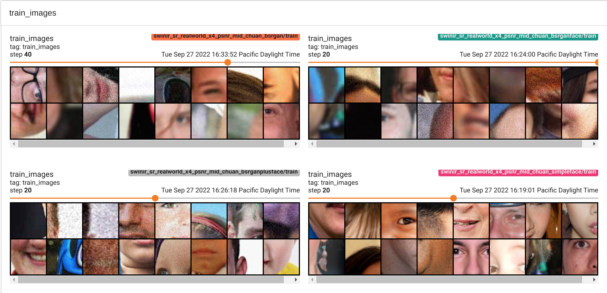
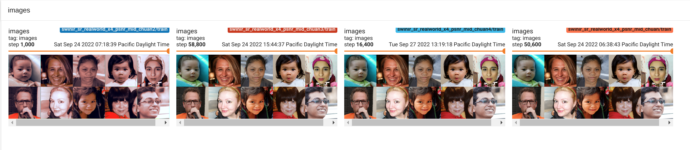

# New SwinIR Features

# Table of Contents
1. [Training](#training)
2. [Inference](#inference)
3. [TensorBoard](#tensorboard)
    1. [Metrics](#metrics)
    2. [Artefacts](#artefacts)
4. [Augmentations and Degradations](#augmentations-and-degradations)
    1. [Augmentation](#augmentation)
    2. [Degradation](#degradation)


## Training
To train, simply used the `main_train_<task>.py` (where <task> is either `psnr` or `gan` with the options file of the model you want to train. For the x2 upscale PSNR and GAN models, use:
```
python main_train_psnr.py --opt options/swinir/train_swinir_sr_realworld_x2_psnr.json
python main_train_gan.py --opt options/swinir/train_swinir_sr_realworld_x2_gan.json
```

For training datasets, you can specify the HQ/LQ pairs (or just the LQ if you're using degradations) in the appropriate options file, or you can just specify `./trainsets/trainH` and `./trainsets/trainL` folders and symbolic link datasets to this directory, like so:
```
ln -s path/to/my/dataset trainsets/trainH/my_dataset
```


## Inference
Inference is similar to training, though with slightly more involved arguments. Use `main_test_swinir.py` and pass the following options:
```
--task : options are real_sr, color_dn, gray_dn, classical_sr, lightweight_sr, jpeg_car. For DV purposes, you should be using real_sr.
--scale : 1, 2, 3, 4, 8, depending on your model. Can be found in options json: opt['netG']['upscale']
--folder_lq : folder of the low quality images you want to super resolve.
--model_path : path to model checkpoint. Should likely store in ./model_zoo directory.
--training_patch_size : specified in the options json file under opt['datasets']['train']['lq_patchsize']. Usually 64 for real_sr task, but 96 for large models.
--gpu-idx : idx of GPU to use
--folder_out : Store the output images here.
```

Example for the Lambda custom x2 face SwinIR model detailed in the super resolution report:
```
python main_test_swinir.py --task=real_sr --scale=2 --training_patch_size=96 --model_path=model_zoo/805000_G.pth --folder_lq path/to/lq_data  --folder_out results --gpu_idx 0
```

## TensorBoard

Tensorboard logging has been added to the `main_train_psnr.py` script. To launch the tensorboard, activate the Python virtual environment and run:

```
tensorboard --logdir=<path-root-in-your-config-file>
```


### Metrics
We log the training loss (`Loss/G_loss`), the model's PSNR performance on validation images (`Val PSNR`), and learning rate (`lr`).

Here are examples of experiments with different learning rates and image degradation settings.


### Artefacts

Periodically, we save the training input images and validation outputs.

Here are the trainig input images with different augmentation and degradation settings. See the [Augmentations and Degradations](#augmentations-and-degradations) section for more details:


To enable logging the training images, you need to add `train.checkpoint_data` attribute to the config file. For example:

```
, "train": {
  ...
  , "checkpoint_data": 10             // for logging input data (checking degredation)
  }

```

Here are the validation outputs from different experiments.



## Augmentations and Degradations

### Augmentation

All image augmentations are implemented [here](https://github.com/DeepVoodooFX/KAIR/blob/c8f5a7c8de352aaaa86027c0adfd7301018d114d/utils/utils_image.py#L384). The original repo uses [filename](https://github.com/DeepVoodooFX/KAIR/blob/f4e7d47a10d9c9df708bc2df542a8235b0179554/data/dataset_blindsr.py#L61) to customize augmenations for face images, which is very inconvenient.

We fixed it in this [commit](https://github.com/DeepVoodooFX/KAIR/commit/22f91231c161501905f13cb34247c842233bba49). Now you can specify the "subject" of the dataset in the config file. Setting `subject` to `face` will only augment the image with horizontal flipping. Leaving it unset will use multiple different combinations of flipping and rotations.

```
  , "datasets": {
    "train": {
       ...
      , "dataloader_batch_size": 16      // batch size 1 | 16 | 32 | 48 | 64 | 128. Total batch size =4x8=32 in SwinIR
      , "subject": "face"
    }
```

### Degradation

All image degradations are implemented as [bsrgan](https://github.com/DeepVoodooFX/KAIR/blob/22f91231c161501905f13cb34247c842233bba49/utils/utils_blindsr.py#L487), [bsrgan_plus](https://github.com/DeepVoodooFX/KAIR/blob/22f91231c161501905f13cb34247c842233bba49/utils/utils_blindsr.py#L579). In addition to downsampling, these degradations applies additional blur, guassian noise, JPEG noise and sensor noise to the training input images. These might not be desirable especially when it comes to traning SR model for a specific type of artefacts (e.g. reduce the quality gap for faceswap models).

This [commit](https://github.com/DeepVoodooFX/KAIR/commit/22f91231c161501905f13cb34247c842233bba49) add a [simple degradation method](https://github.com/DeepVoodooFX/KAIR/blob/22f91231c161501905f13cb34247c842233bba49/utils/utils_blindsr.py#L431) that only applies downsampling. To use this method, set the config file accordingly

```
  , "datasets": {
    "train": {
      ...
      , "dataroot_L": null            // path of L training dataset
      , "degradation_type": "simple"    // "bsrgan" | "bsrgan_plus" | "simple"
```

Some examples of different agumentations and degradation can be found in this [figure](#artefacts)


